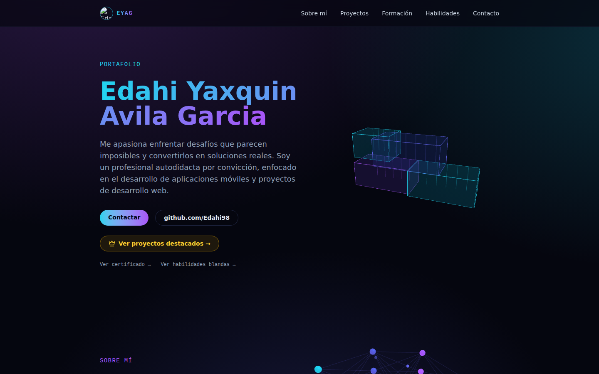
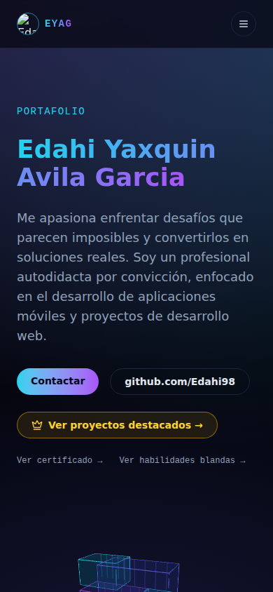
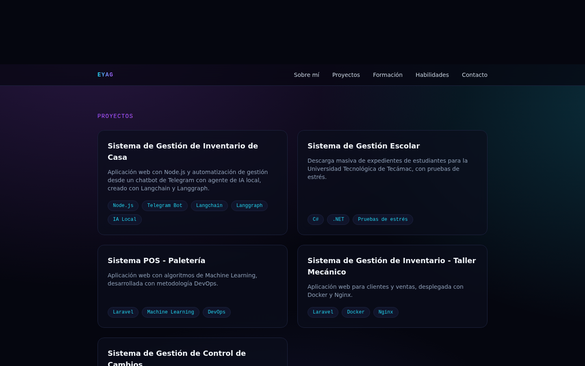
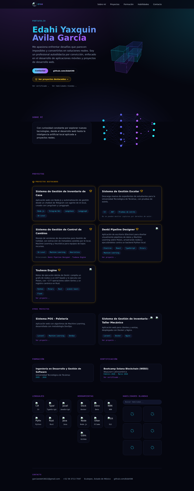

# PortafolioShowCase

Portafolio personal de Edahi Yaxquin Avila Garcia, construido con [Astro](https://astro.build) y [Tailwind CSS](https://tailwindcss.com).

🔗 **Demo en vivo:** [portafolioshowcase.vercel.app](https://portafolioshowcase.vercel.app)

## Capturas

| Hero | Móvil |
| :--: | :--: |
|  |  |

| Sección de Proyectos |
| :--: |
|  |

<details>
<summary>Ver página completa</summary>



</details>

## Stack

- **Astro 5** (TypeScript en modo `strict`)
- **Tailwind CSS v4** vía `@tailwindcss/vite`
- **React 19** — únicamente para islas interactivas (ver sección de arquitectura)
- **Three.js** para las escenas 3D del hero (contenedores estilo Docker) y de la sección "Sobre mí" (red neuronal)
- **anime.js** para las animaciones de la red neuronal
- **axios** para el fetch del catálogo de proyectos desde GitHub

## Arquitectura de islas (Astro + React)

El sitio es **SSG puro** (Static Site Generation): Astro genera todas las páginas en HTML estático en tiempo de build. No hay servidor en runtime.

Para la sección de Proyectos se usa el patrón de **islas de Astro** (`client:visible`): el resto del DOM es HTML estático, y solo el componente `ProyectosIsla` se hidrata en el cliente cuando entra al viewport.

```
┌─────────────────────────────────────────────────┐
│                 index.astro (SSG)               │
│                                                 │
│  ┌──────────┐  ┌──────────┐  ┌──────────────┐  │
│  │  Navbar  │  │   Hero   │  │   SobreMi    │  │  ← HTML estático, 0 JS
│  │  .astro  │  │  .astro  │  │   .astro     │  │
│  └──────────┘  └──────────┘  └──────────────┘  │
│                                                 │
│  ┌──────────────────────────────────────────┐   │
│  │         Proyectos.astro (wrapper)        │   │
│  │                                          │   │
│  │  ╔════════════════════════════════════╗  │   │
│  │  ║  ProyectosIsla  (isla React)       ║  │   │  ← hidratada con client:visible
│  │  ║                                    ║  │   │
│  │  ║  useEffect → axios.get(GitHub)     ║  │   │
│  │  ║       ↓                            ║  │   │
│  │  ║  public/data/proyectos.json        ║  │   │
│  │  ║       ↓                            ║  │   │
│  │  ║  render tarjetas                   ║  │   │
│  │  ╚════════════════════════════════════╝  │   │
│  └──────────────────────────────────────────┘   │
│                                                 │
│  ┌──────────┐  ┌──────────┐  ┌──────────────┐  │
│  │ Formacion│  │Habilidades│  │   Footer     │  │  ← HTML estático, 0 JS
│  │  .astro  │  │  .astro  │  │   .astro     │  │
│  └──────────┘  └──────────┘  └──────────────┘  │
└─────────────────────────────────────────────────┘
```

### Flujo de datos de proyectos

```
public/data/proyectos.json          ← fuente de verdad única
        │
        ├── BUILD TIME (Astro SSG)
        │       src/data/proyectos.ts  →  re-exporta con tipos
        │               │
        │               └──  src/pages/proyectos/[slug].astro
        │                       getStaticPaths() → genera /proyectos/creamyx,
        │                                          /proyectos/reddragon, etc.
        │
        └── RUNTIME (isla React)
                axios.get(raw.githubusercontent.com/.../proyectos.json)
                        │
                        └──  ProyectosIsla.tsx → renderiza tarjetas
```

> Para actualizar el catálogo basta con editar `public/data/proyectos.json` y hacer push a `main`; el sitio se redeploya automáticamente en Vercel.

Ver [docs/proyectos-json-schema.md](./docs/proyectos-json-schema.md) para el esquema completo del JSON.

### Directiva `client:visible`

`<ProyectosIsla client:visible />` le indica a Astro que:

1. En el build, el componente se pre-renderiza a HTML estático (skeleton vacío).
2. En el cliente, el JS de React se descarga e hidrata **solo cuando el elemento entra al viewport** (Intersection Observer), no al cargar la página.

Esto mantiene el Time to Interactive bajo: el JS de React y axios solo se ejecuta si el usuario llega a ver la sección.

## Estructura del proyecto

```text
src/
├── components/
│   ├── atoms/                   # piezas pequeñas reutilizables
│   │   ├── LanguageGrid.astro
│   │   ├── ToolGrid.astro
│   │   └── SoftSkillList.astro
│   ├── ProyectosIsla.tsx        # isla React (única excepción a Astro puro)
│   ├── Navbar.astro
│   ├── Hero.astro
│   ├── SobreMi.astro
│   ├── Proyectos.astro          # wrapper que monta la isla
│   ├── Formacion.astro
│   ├── Habilidades.astro
│   ├── Footer.astro
│   ├── DockerScene.astro
│   └── NeuralNetworkScene.astro
├── data/
│   └── proyectos.ts             # tipos + re-exporta public/data/proyectos.json
├── pages/
│   ├── index.astro              # compone las secciones del Home
│   ├── cv.astro
│   ├── certificado-solana.astro
│   └── proyectos/
│       └── [slug].astro         # página dinámica por proyecto
└── styles/
    └── global.css               # tema (paleta, tarjetas glass, texto en degradado)

public/
└── data/
    └── proyectos.json           # fuente de verdad del catálogo

docs/
├── proyectos-json-schema.md     # esquema del JSON de proyectos
└── screenshots/
```

Ver [CLAUDE.md](./CLAUDE.md) para el detalle del sistema de diseño.

## Comandos

Todos los comandos se ejecutan desde la raíz del proyecto:

| Comando           | Acción                                          |
| :----------------- | :----------------------------------------------- |
| `npm install`       | Instala las dependencias                          |
| `npm run dev`       | Levanta el servidor de desarrollo en `localhost:4321` |
| `npm run build`     | Compila el sitio para producción en `./dist/`     |
| `npm run preview`   | Previsualiza el build de producción localmente    |
