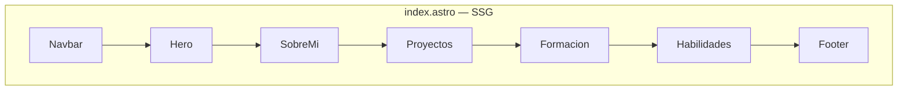

# PortafolioShowCase

Portafolio personal de Edahi Yaxquin Avila Garcia, construido con [Astro](https://astro.build) y [Tailwind CSS](https://tailwindcss.com).

🔗 **Demo en vivo:** [portafolioshowcase.vercel.app](https://portafolioshowcase.vercel.app)

## Stack

- **Astro 5** (TypeScript en modo `strict`) — sin ningún framework de UI, todo es Astro puro sin islas ni hidratación client-side
- **Tailwind CSS v4** vía `@tailwindcss/vite` — tema definido con `@theme` en `global.css`, sin `tailwind.config`
- **Three.js** para la escena 3D de la red neuronal (`NeuralNetworkScene.astro`)
- **anime.js v4** para animaciones de partículas y pulsos en la red neuronal
- **@lucide/astro** para íconos SVG dentro de componentes `.astro`

## Tema visual

Paleta oscura azul-morada definida en `src/styles/global.css`:

| Token | Valor | Uso |
| :--- | :--- | :--- |
| `--color-bg` | `#161950` | Fondo de página |
| `--color-primary` | `yellow-400` | Acento principal, botones, texto destacado |
| `--color-secondary` | `rose-500` | Headings de sección, botón Ver CV |
| `--color-accent` | `cyan-400` | Acento terciario |
| `--color-surface` | `#1e215e` | Fondo de tarjetas |
| `--color-border` | `#323678` | Bordes |

Clases utilitarias: `.glass-card` (tarjeta semitransparente con backdrop-blur), `.text-gradient` (degradado amarillo → rosa).

## Arquitectura

El sitio es **SSG puro** — Astro genera todo en HTML estático en build time. No hay servidor en runtime ni hidratación client-side.



### Hero

El hero muestra el nombre, descripción y botones a la izquierda, y a la derecha un **TrailerScene** compuesto por:

- `game-title.png` con máscara de desvanecimiento
- `GameMosaic` — mosaico 2×2 de capturas del juego "Pasar es Pasar"
- `<audio>` oculto con el audio del trailer + `UnmuteButton` para reproducirlo
- Badge de 2.° lugar en el Concurso de Videojuegos UTTecámac (enlaza a `/#reconocimientos`)

## Estructura del proyecto

```text
src/
├── components/
│   ├── atoms/                    # piezas pequeñas reutilizables
│   │   ├── CertCard.astro        # tarjeta linkeable (certificados, cursos, reconocimientos)
│   │   ├── FormacionCard.astro   # tarjeta estática (formación académica)
│   │   ├── GameArt.astro         # imagen decorativa con máscara
│   │   ├── GameMosaic.astro      # mosaico 2×2 de capturas del juego
│   │   ├── LanguageGrid.astro    # grid de lenguajes con skillicons.dev
│   │   ├── SoftSkillList.astro   # lista de habilidades blandas con colores
│   │   ├── ToolGrid.astro        # grid de herramientas con skillicons.dev
│   │   └── UnmuteButton.astro    # botón play/pause para el audio del trailer
│   ├── TrailerScene.astro        # escena hero: título + mosaico + audio
│   ├── NeuralNetworkScene.astro  # red neuronal Three.js + anime.js
│   ├── DockerScene.astro         # escena 3D de contenedores (sin uso activo)
│   ├── Navbar.astro
│   ├── Hero.astro
│   ├── SobreMi.astro
│   ├── Proyectos.astro
│   ├── Formacion.astro           # orquestador: importa datos y atoms
│   ├── Habilidades.astro
│   └── Footer.astro              # bloque Rust/serde_json con Ferris
├── data/
│   ├── formacion.ts              # formación, certificaciones, cursos, reconocimientos
│   └── proyectos.ts              # tipos + proyectos con slug e imágenes
├── pages/
│   ├── index.astro               # compone las secciones del Home
│   ├── cv.astro
│   ├── certificado-solana.astro
│   ├── curso-webscraping.astro
│   ├── reconocimiento-videojuegos.astro
│   └── proyectos/
│       └── [slug].astro          # página dinámica por proyecto
└── styles/
    └── global.css                # tema (paleta, glass-card, text-gradient)

public/
├── certificados/                 # PDFs de certificados
├── reconocimientos/              # imágenes de reconocimientos
├── proyectos/                    # capturas por slug de proyecto
└── videos/                       # assets del trailer (MP3, PNGs)
```

Ver [CLAUDE.md](./CLAUDE.md) para el detalle completo del sistema de diseño y convenciones del proyecto.

## Secciones

| Sección | Descripción |
| :--- | :--- |
| **Hero** | Nombre, descripción, botones de contacto y trailer del juego "Pasar es Pasar" |
| **Sobre mí** | Texto breve + red neuronal animada con Three.js |
| **Proyectos** | Galería de proyectos destacados con páginas de showcase |
| **Formación** | Educación, certificaciones (Solana WEB3), cursos (Web Scraping), reconocimientos |
| **Habilidades** | Lenguajes, herramientas y habilidades blandas |

## Comandos

| Comando | Acción |
| :--- | :--- |
| `npm install` | Instala las dependencias |
| `npm run dev` | Servidor de desarrollo en `localhost:4321` |
| `npm run build` | Compila el sitio para producción en `./dist/` |
| `npm run preview` | Previsualiza el build de producción localmente |
